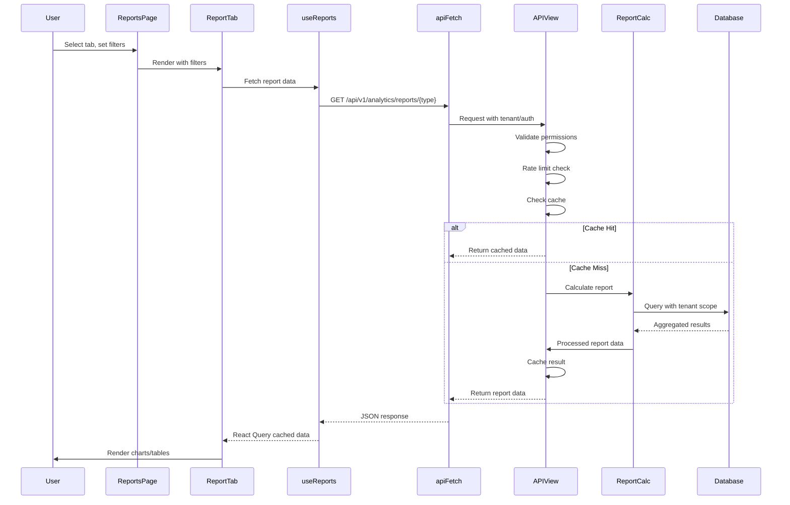

<!-- 290596b9-fdc0-4931-9d74-5e0e90a3adf7 922dbd37-84d4-4ea0-9c25-6406d5dc484c -->
# Reports Feature Implementation Plan

## Overview

This plan implements a comprehensive Reports feature for the POS system. The Reports page will provide detailed business analytics through a tabbed interface, allowing tenants to gain insights into sales, products, finances, customers, employees, and returns/refunds.

**Key Decisions:**

- Route: `/reports` (top-level route, consistent with `/sales`, `/inventory`)
- Backend: Extend existing `analytics` service (reuse patterns, avoid duplication)
- Access: Owner and Admin roles (`OwnerOrAdmin` permission)
- Dependencies: All open source (reportlab for PDF, openpyxl for Excel)

---

## Architecture Overview

### Backend Architecture

```
analytics/
├── api_reports.py          # NEW: Main report API endpoints
├── reports/                # NEW: Report calculation modules
│   ├── __init__.py
│   ├── sales_reports.py    # Sales summary, detail, trends
│   ├── financial_reports.py # Financial summaries, tax, discount analysis
│   ├── product_reports.py  # Product performance, best/worst sellers
│   ├── customer_reports.py # Customer analytics, lifetime value
│   └── employee_reports.py # Employee performance metrics
├── api_exports.py          # ENHANCE: Add PDF/Excel export for reports
└── urls.py                 # UPDATE: Add report routes
```

### Frontend Architecture

```
features/reports/
├── ReportsRoute.tsx        # Route component (wraps AppShell)
├── ReportsPage.tsx         # Main page with tabs
├── components/
│   ├── ReportFilters.tsx   # Reusable filter component
│   ├── DateRangePicker.tsx # Enhanced date range picker with presets
│   ├── ReportCharts.tsx    # Chart components (recharts wrapper)
│   ├── ReportTable.tsx     # Data table component
│   └── ExportButton.tsx    # Export functionality (PDF/Excel/CSV)
├── tabs/
│   ├── SalesReportsTab.tsx
│   ├── ProductReportsTab.tsx
│   ├── FinancialReportsTab.tsx
│   ├── CustomerReportsTab.tsx
│   ├── EmployeeReportsTab.tsx
│   └── ReturnsReportsTab.tsx
├── api/
│   └── reports.ts          # API functions
└── hooks/
    └── useReports.ts       # React Query hooks
```

### Data Flow



---

## Implementation Rules & Guidelines

### Security Requirements

1. **Tenant Scoping (MANDATORY)**

   - All queries MUST filter by `request.tenant`
   - Use `_resolve_request_tenant()` helper from existing patterns
   - Never expose data from other tenants
   - Verify store belongs to tenant if `store_id` provided

2. **Role-Based Access Control**

   - Reports endpoints use `IsOwnerOrAdmin` permission
   - Sensitive financial reports may be `IsOwner` only (document in code)
   - Frontend route uses `OwnerOrAdmin` guard component

3. **Input Validation**

   - Validate all query parameters (date ranges, store_id, pagination)
   - Use DRF serializers or explicit validation
   - Return 400 with clear error messages for invalid input
   - Sanitize date ranges (max 365 days, min 1 day)
   - Validate store_id exists and belongs to tenant

4. **Rate Limiting**

   - Implement per-user rate limiting for report endpoints
   - Use Django cache (Redis) for rate limit tracking
   - Limits: 60 requests per minute per user for report endpoints
   - Return 429 with `Retry-After` header when limit exceeded

### Performance Requirements

1. **Database Optimization**

   - Use `select_related()` and `prefetch_related()` to avoid N+1 queries
   - Add database indexes on frequently queried fields:
     - `Sale.created_at` (already exists, verify)
     - `SaleLine.sale_id`, `SaleLine.variant_id`
     - Composite indexes for common filter combinations
   - Use database aggregations (`Sum`, `Count`, `Avg`) instead of Python loops
   - Limit result sets with pagination (default 100 rows per page)

2. **Caching Strategy**

   - Cache expensive report calculations for 5 minutes
   - Cache key format: `report:{report_type}:{tenant_id}:{hash_of_params}`
   - Invalidate cache on data changes (sale created, return processed)
   - Use Redis if available, fallback to Django cache

3. **Query Optimization**

   - Use `values()` and `annotate()` for aggregations
   - Avoid fetching unnecessary fields
   - Use `only()` or `defer()` when appropriate
   - Consider database views for complex recurring queries (future optimization)

4. **Background Jobs (Optional)**

   - For very heavy reports (>10,000 records), consider Celery tasks
   - Generate reports asynchronously, notify user when ready
   - Store generated reports temporarily (24-hour TTL)

### Error Handling

1. **Backend**

   - Catch all exceptions, log with context (tenant_id, user_id, params)
   - Return appropriate HTTP status codes (400, 401, 403, 404, 429, 500)
   - Provide user-friendly error messages (no stack traces in production)
   - Use Django logging framework with appropriate log levels

2. **Frontend**

   - Implement React ErrorBoundary component for report tabs
   - Display user-friendly error messages
   - Retry failed requests with exponential backoff
   - Show loading states during data fetching
   - Handle empty states gracefully

### Data Accuracy

1. **Database Aggregations Only**

   - All calculations MUST be done in database queries
   - Never sum/calculate in Python/JavaScript (except for display formatting)
   - Use `DecimalField` for monetary values to avoid floating-point errors

2. **Timezone Handling**

   - Use `_tenant_timezone()` helper from existing analytics patterns
   - Convert all date filters to tenant's timezone
   - Store timestamps in UTC, display in tenant timezone

3. **Currency Handling**

   - All currency formatting MUST use tenant's currency settings
   - Backend: Include currency info (`code`, `symbol`, `precision`) in all report responses
     - Retrieve from tenant: `resolved_currency` or `currency_code` (fallback to "USD")
     - Include: `currency_symbol` and `currency_precision` from tenant
   - Frontend: Use `useMoney` hook from `features/sales/useMoney.ts`
     - Extract currency from API responses (both summary and detail reports)
     - Use `safeMoney()` function for all currency formatting (no hardcoded "$" or "USD")
     - Charts: Use currency symbol dynamically in Y-axis labels and tooltips
     - Summary cards: Use `safeMoney()` for all revenue/AOV displays
     - Detail tables: Use `safeMoney()` for all monetary values
   - Pattern to follow:
     ```typescript
     // In component:
     const [currency, setCurrency] = useState<CurrencyInfo>({ code: "USD", symbol: "$", precision: 2 });
     const { safeMoney } = useMoney(currency);
     
     // Update from API response:
     useEffect(() => {
       if (summaryData?.currency) {
         setCurrency({
           code: summaryData.currency.code || "USD",
           symbol: summaryData.currency.symbol || undefined,
           precision: summaryData.currency.precision ?? 2,
         });
       }
     }, [summaryData?.currency]);
     
     // Use in render:
     {safeMoney(value)}  // Instead of formatCurrency or hardcoded "$"
     ```


4. **Audit Logging**

   - Log all report exports (PDF/Excel) with:
     - User ID, tenant ID, report type, date range, export format
     - Store in audit log table (extend existing `AuditLog` if available)

---

## Phase 1: Foundation & Infrastructure (Week 1)

### Task 1.1: Backend Foundation Setup

**Files to Create:**

- `pos-backend/analytics/api_reports.py` - Main report API views
- `pos-backend/analytics/reports/__init__.py` - Package init
- `pos-backend/analytics/reports/base.py` - Base report utilities (date parsing, tenant scoping, validation)

**Files to Modify:**

- `pos-backend/analytics/urls.py` - Add report routes

**Implementation Details:**

1. Create `BaseReportView(APIView)` class with:

   - Common permission classes (`IsAuthenticated`, `IsOwnerOrAdmin`)
   - Tenant resolution helper
   - Date range parsing and validation
   - Store ID validation
   - Rate limiting decorator
   - Caching helper methods

2. Create utility functions:

   - `parse_date_range(start, end, max_days=365)` - Validate and parse date ranges
   - `validate_store_access(store_id, tenant)` - Verify store belongs to tenant
   - `get_cache_key(report_type, tenant_id, params)` - Generate cache keys
   - `get_tenant_timezone(tenant)` - Get tenant timezone (reuse existing)

3. Add rate limiting decorator using Django cache:
   ```python
   def rate_limit_report(view_func):
       # Implement per-user rate limiting (60 req/min)
   ```

4. Add URL patterns:
   ```python
   path("reports/sales/summary", SalesSummaryReportView.as_view()),
   path("reports/sales/detail", SalesDetailReportView.as_view()),
   # ... more routes
   ```


**References:**

- Use `_resolve_request_tenant()` pattern from `analytics/api_vendor.py`
- Use `_to_aware_dt()` pattern from `orders/views.py` for date parsing
- Use rate limiting pattern from `otp/services.py`

### Task 1.2: Frontend Foundation Setup

**Files to Create:**

- `pos-frontend/src/features/reports/ReportsRoute.tsx`
- `pos-frontend/src/features/reports/ReportsPage.tsx`
- `pos-frontend/src/features/reports/components/ReportFilters.tsx`
- `pos-frontend/src/features/reports/components/DateRangePicker.tsx`
- `pos-frontend/src/features/reports/api/reports.ts`
- `pos-frontend/src/features/reports/hooks/useReports.ts`
- `pos-frontend/src/components/ErrorBoundary.tsx` (NEW - reusable)

**Files to Modify:**

- `pos-frontend/src/main.tsx` - Add `/reports` route
- `pos-frontend/src/features/home/HomePage.tsx` - Add Reports card

**Implementation Details:**

1. Create `ReportsRoute.tsx`:

   - Wrap `ReportsPage` in `AppShell` (pattern from `SalesRoute.tsx`)
   - Use `OwnerOrAdmin` guard component

2. Create `ReportsPage.tsx`:

   - Tab structure using `Tabs` component (pattern from `InventoryRoute.tsx`)
   - State management for active tab and filters
   - URL parameter handling for deep linking (tab, date range)

3. Create `ReportFilters.tsx`:

   - Store selector (reuse pattern from `SalesToolbar.tsx`)
   - Date range picker integration
   - Export buttons (PDF/Excel/CSV)
   - Responsive layout

4. Create `DateRangePicker.tsx`:

   - Date inputs with validation
   - Preset buttons (Today, Last 7 Days, Last 30 Days, This Month, Last Month, Custom)
   - Timezone-aware display

5. Create `ErrorBoundary.tsx`:

   - React ErrorBoundary component
   - Display user-friendly error message
   - Log errors for debugging
   - Provide retry mechanism

6. Create API functions (`api/reports.ts`):

   - Use `apiFetch` from `lib/auth.ts` (existing pattern)
   - TypeScript interfaces for all report types
   - Export functions for PDF/Excel generation

7. Create React Query hooks (`hooks/useReports.ts`):

   - `useSalesSummaryReport(params)` - With caching and error handling
   - `useSalesDetailReport(params)` - With pagination
   - Similar hooks for other report types
   - Proper query key structure for cache invalidation

**References:**

- Use `apiFetch` pattern from `features/sales/api.ts`
- Use React Query patterns from `features/inventory/hooks/`
- Use filter component patterns from `features/sales/components/SalesToolbar.tsx`

### Task 1.3: Add Dependencies

**Files to Modify:**

- `pos-backend/requirements.txt`

**Implementation:**

- Add `reportlab>=4.0.0` for PDF generation
- Add `openpyxl>=3.1.0` for Excel export

**Note:** Both are MIT licensed (open source)

---

## Phase 2: Sales Reports (Week 2)

### Task 2.1: Backend - Sales Summary Report

**Files to Create:**

- `pos-backend/analytics/reports/sales_reports.py`

**Files to Modify:**

- `pos-backend/analytics/api_reports.py` - Add `SalesSummaryReportView`

**Implementation Details:**

1. Create `calculate_sales_summary(tenant, store_id, date_from, date_to)`:

   - Aggregate: total revenue, order count, average order value
   - Compare with previous period (same duration)
   - Break down by day/week/month (based on date range)
   - Filter by store if provided
   - Use database aggregations only (`Sum`, `Count`, `Avg`)

2. Create `SalesSummaryReportView(BaseReportView)`:

   - `GET /api/v1/analytics/reports/sales/summary`
   - Query params: `store_id`, `date_from`, `date_to`, `group_by` (day/week/month)
   - Response includes:
     - Summary metrics (revenue, orders, AOV)
     - Period comparison (vs previous period)
     - Time series data for charts
     - Store breakdown if multiple stores

3. Add caching:

   - Cache for 5 minutes
   - Cache key includes tenant_id, store_id, date range

**Database Queries:**

- Use `Sale.objects.filter(tenant=tenant, created_at__range=[date_from, date_to])`
- Annotate with `Sum('total')`, `Count('id')`
- Group by date using `TruncDate` or `TruncWeek`/`TruncMonth`

### Task 2.2: Backend - Sales Detail Report

**Implementation:**

1. Create `SalesDetailReportView(BaseReportView)`:

   - `GET /api/v1/analytics/reports/sales/detail`
   - Query params: `store_id`, `date_from`, `date_to`, `status`, `page`, `page_size`
   - Returns paginated list of sales with line items
   - Reuse `SaleListSerializer` from `orders/serializers.py` if available

2. Support pagination:

   - Default page_size: 100
   - Max page_size: 1000
   - Use DRF pagination

### Task 2.3: Frontend - Sales Reports Tab

**Files to Create:**

- `pos-frontend/src/features/reports/tabs/SalesReportsTab.tsx`
- `pos-frontend/src/features/reports/components/SalesReportCharts.tsx`

**Implementation:**

1. Create `SalesReportsTab.tsx`:

   - Display summary cards (Total Revenue, Orders, AOV, Growth %)
   - Display charts (revenue trend, orders trend, AOV trend)
   - Display detail table with pagination
   - Use `ReportFilters` component
   - Use `ErrorBoundary` wrapper

2. Create `SalesReportCharts.tsx`:

   - Line chart for revenue trend (recharts)
   - Bar chart for orders
   - Area chart for AOV
   - Responsive design

3. Implement React Query hooks:

   - `useSalesSummaryReport()` - Fetch summary data
   - `useSalesDetailReport()` - Fetch paginated detail data

**UI/UX:**

- Loading skeletons while fetching
- Empty states when no data
- Error messages with retry button
- Responsive charts (mobile-friendly)

---

## Phase 3: Product Reports (Week 2-3)

### Task 3.1: Backend - Product Performance Report

**Files to Modify:**

- `pos-backend/analytics/reports/product_reports.py` (NEW)
- `pos-backend/analytics/api_reports.py`

**Implementation:**

1. Create `calculate_product_performance(tenant, store_id, date_from, date_to, limit=50)`:

   - Aggregate by variant: revenue, quantity sold, units sold
   - Sort by revenue (descending) for top products
   - Include product name, SKU, category
   - Filter by store if provided

2. Create `ProductPerformanceReportView(BaseReportView)`:

   - `GET /api/v1/analytics/reports/products/performance`
   - Query params: `store_id`, `date_from`, `date_to`, `limit`, `sort_by` (revenue/qty)
   - Response includes:
     - Top products by revenue
     - Top products by quantity
     - Product trends over time (optional)

**Database Queries:**

- Join `SaleLine` with `Variant` and `Product`
- Aggregate using `Sum('line_total')`, `Sum('qty')`
- Group by variant/product

### Task 3.2: Frontend - Product Reports Tab

**Files to Create:**

- `pos-frontend/src/features/reports/tabs/ProductReportsTab.tsx`

**Implementation:**

1. Display top products table:

   - Columns: Product Name, SKU, Category, Revenue, Quantity Sold, Avg Price
   - Sortable columns
   - Pagination

2. Display charts:

   - Bar chart for top 10 products by revenue
   - Bar chart for top 10 products by quantity
   - Pie chart for category distribution

---

## Phase 4: Financial Reports (Week 3)

### Task 4.1: Backend - Financial Summary Report

**Files to Create:**

- `pos-backend/analytics/reports/financial_reports.py`

**Implementation:**

1. Create `calculate_financial_summary(tenant, store_id, date_from, date_to)`:

   - Total revenue
   - Total discounts applied
   - Total taxes collected
   - Net revenue (revenue - discounts)
   - Break down by payment method
   - Break down discounts by rule
   - Break down taxes by rule

2. Create `FinancialSummaryReportView(BaseReportView)`:

   - `GET /api/v1/analytics/reports/financial/summary`
   - Query params: `store_id`, `date_from`, `date_to`

**Database Queries:**

- Aggregate from `Sale` model (total, discount_total, tax_total)
- Aggregate from `SalePayment` for payment method breakdown
- Parse `receipt_data` JSON for discount/tax rule breakdown (if stored)

### Task 4.2: Frontend - Financial Reports Tab

**Files to Create:**

- `pos-frontend/src/features/reports/tabs/FinancialReportsTab.tsx`

**Implementation:**

1. Display financial summary cards:

   - Total Revenue, Discounts, Taxes, Net Revenue
   - Percentage breakdowns

2. Display charts:

   - Pie chart for payment methods
   - Bar chart for discount rules
   - Bar chart for tax rules
   - Revenue vs Discounts trend

---

## Phase 5: Customer & Employee Reports (Week 4)

### Task 5.1: Backend - Customer Analytics

**Files to Create:**

- `pos-backend/analytics/reports/customer_reports.py`

**Implementation:**

1. Create `calculate_customer_analytics(tenant, store_id, date_from, date_to)`:

   - Top customers by revenue
   - Customer lifetime value (if customer model exists)
   - Repeat customer rate
   - New vs returning customers

2. Create `CustomerAnalyticsReportView(BaseReportView)`:

   - `GET /api/v1/analytics/reports/customers/analytics`

**Note:** Requires `Customer` model with sales relationships

### Task 5.2: Backend - Employee Performance

**Files to Create:**

- `pos-backend/analytics/reports/employee_reports.py`

**Implementation:**

1. Create `calculate_employee_performance(tenant, store_id, date_from, date_to)`:

   - Sales by cashier
   - Transaction count by cashier
   - Average transaction value by cashier
   - Return rate by cashier

2. Create `EmployeePerformanceReportView(BaseReportView)`:

   - `GET /api/v1/analytics/reports/employees/performance`

**Database Queries:**

- Group by `Sale.cashier` (User model)
- Aggregate sales metrics per cashier

### Task 5.3: Frontend - Customer & Employee Tabs

**Files to Create:**

- `pos-frontend/src/features/reports/tabs/CustomerReportsTab.tsx`
- `pos-frontend/src/features/reports/tabs/EmployeeReportsTab.tsx`

**Implementation:**

- Tables showing top customers/employees
- Charts for visualization
- Filter by store and date range

---

## Phase 6: Returns Reports & Export Functionality (Week 4-5)

### Task 6.1: Backend - Returns Report

**Files to Modify:**

- `pos-backend/analytics/reports/financial_reports.py` (extend)

**Implementation:**

1. Create `calculate_returns_analysis(tenant, store_id, date_from, date_to)`:

   - Total returns count
   - Total refunded amount
   - Return rate (% of sales)
   - Break down by reason code
   - Break down by disposition (restock/waste)

2. Create `ReturnsReportView(BaseReportView)`:

   - `GET /api/v1/analytics/reports/returns/analysis`

**Database Queries:**

- Aggregate from `Return` and `ReturnItem` models
- Join with `Sale` for return rate calculation

### Task 6.2: Backend - Export Functionality

**Files to Modify:**

- `pos-backend/analytics/api_exports.py` - Enhance for reports

**Implementation:**

1. Create `ReportExportView(BaseReportView)`:

   - `POST /api/v1/analytics/reports/export`
   - Body: `report_type`, `format` (pdf/excel/csv), `params` (filters)
   - Generate PDF using reportlab
   - Generate Excel using openpyxl
   - Generate CSV (existing pattern)

2. PDF Generation:

   - Include tenant name, report title, date range
   - Include summary statistics
   - Include charts (convert to images or use text tables)
   - Include data tables
   - Add watermark/header/footer

3. Excel Generation:

   - Multiple sheets if applicable (summary, details, charts data)
   - Format numbers, dates properly
   - Add headers with report metadata

4. Audit Logging:

   - Log export requests to audit log
   - Include: user_id, tenant_id, report_type, format, date_range

### Task 6.3: Frontend - Returns Tab & Export UI

**Files to Create:**

- `pos-frontend/src/features/reports/tabs/ReturnsReportsTab.tsx`
- `pos-frontend/src/features/reports/components/ExportButton.tsx`

**Implementation:**

1. Returns tab:

   - Display return metrics
   - Charts for return trends
   - Table of returns by reason

2. Export button:

   - Dropdown with format options (PDF, Excel, CSV)
   - Loading state during export
   - Download file when ready
   - Error handling

---

## Phase 7: Production Hardening (Week 5)

### Task 7.1: Add Global Rate Limiting

**Files to Create:**

- `pos-backend/analytics/middleware.py` (or extend common middleware)

**Implementation:**

1. Create rate limiting middleware/decorator:

   - 60 requests per minute per user for report endpoints
   - Use Django cache (Redis if available)
   - Return 429 with `Retry-After` header
   - Log rate limit violations

2. Apply to all report views

### Task 7.2: Add Response Caching

**Files to Modify:**

- `pos-backend/analytics/api_reports.py`

**Implementation:**

1. Add caching decorator/helper:

   - Cache expensive queries (summary reports) for 5 minutes
   - Cache key: `report:{type}:{tenant_id}:{params_hash}`
   - Invalidate on data changes (optional, future enhancement)

2. Use Django cache backend (Redis if configured, else default)

### Task 7.3: Frontend Error Boundary & UX Enhancements

**Files to Modify:**

- `pos-frontend/src/components/ErrorBoundary.tsx` (enhance)
- All report tabs (wrap with ErrorBoundary)

**Implementation:**

1. Enhance ErrorBoundary:

   - Display user-friendly error message
   - Log errors to console (and optionally to error tracking service)
   - Provide retry button
   - Show error ID for support

2. Add loading skeletons:

   - Replace simple spinners with skeleton loaders
   - Match content structure

3. Add empty states:

   - Friendly messages when no data
   - Suggest actions (adjust filters, check date range)

4. Add keyboard navigation:

   - Tab navigation for all interactive elements
   - Keyboard shortcuts for common actions (Ctrl+E for export)

### Task 7.4: Database Indexes

**Files to Modify:**

- `pos-backend/orders/migrations/XXXX_add_report_indexes.py` (NEW migration)

**Implementation:**

1. Add indexes if not present:

   - `Sale.created_at` (verify existing)
   - `Sale(tenant_id, created_at, status)` - composite index
   - `SaleLine(sale_id, variant_id)` - for product reports
   - `Return(tenant_id, created_at, status)` - for returns reports

2. Run migration and verify query performance

---

## Testing Requirements

### Backend Testing

1. **Unit Tests:**

   - Test report calculation functions
   - Test date range validation
   - Test tenant scoping
   - Test rate limiting
   - Test caching

2. **Integration Tests:**

   - Test full API endpoints
   - Test with multiple tenants (ensure no data leakage)
   - Test pagination
   - Test export generation

**Files to Create:**

- `pos-backend/analytics/tests_reports.py`

### Frontend Testing

1. **Component Tests:**

   - Test report tabs render correctly
   - Test filter interactions
   - Test error states
   - Test loading states

2. **Integration Tests:**

   - Test data fetching
   - Test export functionality
   - Test error boundary

**Note:** Use existing testing patterns if test framework is set up

---

## Documentation

### Files to Create/Update

1. **API Documentation:**

   - Update OpenAPI schema (drf-spectacular will auto-generate)
   - Add docstrings to all report views

2. **User Documentation:**

   - Create `docs/Reports_User_Guide.md` with:
     - How to access reports
     - Available report types
     - How to use filters
     - How to export reports
     - Understanding report metrics

3. **Developer Documentation:**

   - Update `docs/pos_stack_knowledge_map.md` with report endpoints
   - Document report calculation logic
   - Document caching strategy

---

## Rollout Plan

1. **Phase 1 (Foundation)**: Deploy backend foundation, frontend routing, no reports yet
2. **Phase 2 (Sales Reports)**: Deploy sales reports, test with real data
3. **Phase 3-6 (Additional Reports)**: Deploy incrementally, one report type at a time
4. **Phase 7 (Hardening)**: Deploy production optimizations, monitor performance

---

## Success Criteria

- All reports load within 2 seconds (cached) or 5 seconds (uncached)
- No tenant data leakage (security audit)
- Rate limiting prevents abuse
- Error states handled gracefully
- Export functionality works for all formats
- Mobile-responsive UI
- Accessible (keyboard navigation, screen readers)

---

## Future Enhancements (Out of Scope)

- Scheduled report email delivery
- Custom report builder
- Advanced filtering (product categories, customer segments)
- Real-time report updates (WebSocket)
- Report templates and customization
- Comparison across multiple date ranges
- Forecasting reports