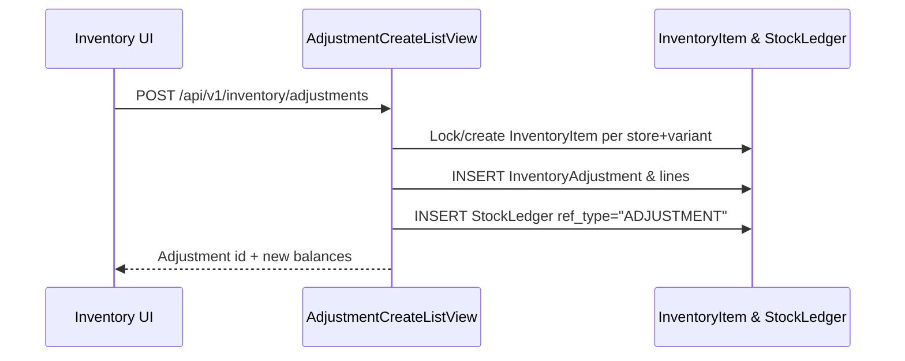
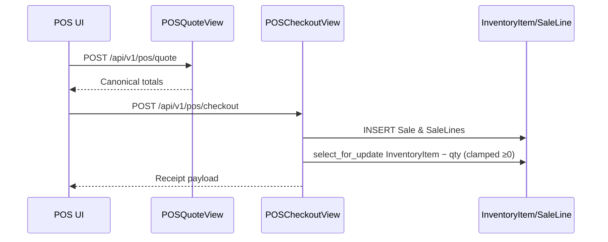
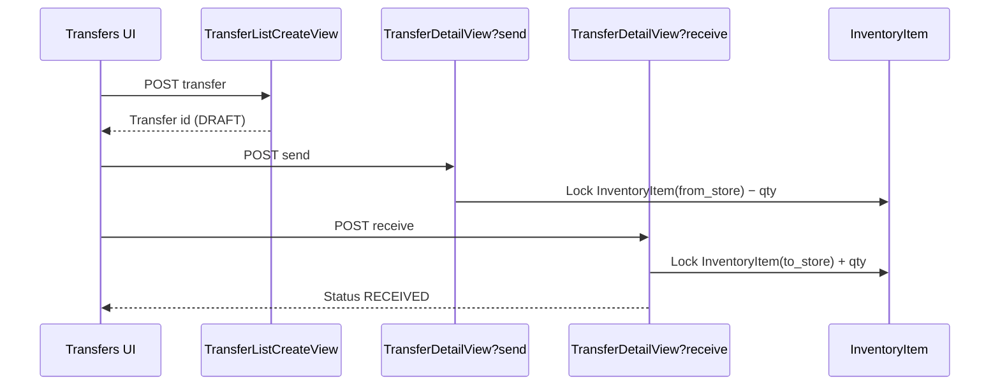
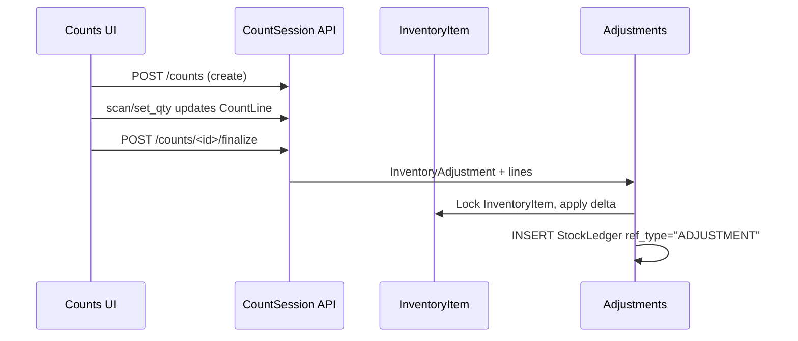

**A. Executive Summary (Inventory + POS)**  
The system lets store teams maintain per-variant stock, capture adjustments/transfers/counts, and run a React-based POS that quotes totals, applies coupons, takes cash/card payments, and records orders/returns per tenant. Owners also get dashboards with low-stock alerts, recent sales, and revenue trends.  
Technically, Django apps (`inventory`, `pos`, `orders`, `catalog`, etc.) expose REST endpoints protected by tenant middleware; `InventoryItem` holds the canonical on-hand quantity, and adjustments/counts feed a new `StockLedger` audit log. POS checkout lives in `pos/views.py` and re-uses `orders` models plus a shared `compute_receipt` service for totals. The React/Vite front-end (AppShell + feature routes) consumes these APIs via `ensureAuthedFetch`, with dedicated modules for POS, inventory, transfers, and counts.  
Top risks and gaps:
- `pos/views.py:552-559` decrements inventory but clamps to zero, never writes a ledger entry, and therefore hides oversells while Inventory > Recent feeds never show POS sales.
- `pos/views.py:535-618` stores SaleLine discounts/taxes calculated before `compute_receipt`, so canonical totals in receipts diverge from persisted lines/returns logic.
- `orders/apps.py` never imports `orders/signals.py`, so non-POS SaleLine creations (admin, imports) will not touch inventory or stock history.
- `inventory/api.py:560-599` logs transfers with ref_type `TRANSFER_OUT/IN` that is invalid per `inventory/models.py:92-100`, ignores requested partial receipts, and the list endpoint lacks the filters/line counts the React UI expects.
- Hard-coded low-stock thresholds and client-side stock enforcement (`inventory/api.py:78`, `inventory/views.py:16-25`, `src/features/pos/PosScreen.tsx:31`) make “low stock” inconsistent and configurable only by code changes.
- `pos/views.py:324-369` only checks tenant membership, so any authenticated user can run checkout for any store—register sessions and store assignments are never enforced.
- Operational coverage is minimal: `inventory/tests.py` and `pos/tests.py` are empty, leaving concurrency/edge-case regressions unguarded.

**B. Inventory & POS Map**

_Backend modules_

| App/Module | Purpose | Key Models | Key Services | Key Endpoints | Key Files |
| --- | --- | --- | --- | --- | --- |
| inventory | Store-level stock, adjustments, transfers, counts | InventoryItem, StockLedger, InventoryAdjustment, InventoryTransfer, CountSession/CountLine | `InventoryOverviewView`, `AdjustmentCreateListView`, `TransferDetailView`, `CountFinalizeView` | `/api/v1/inventory/overview, stock, adjustments, ledger, transfers, counts` | `inventory/models.py`, `inventory/api.py`, `inventory/api_counts.py` |
| pos | POS catalog/search/checkout/register auth | (no models), uses orders + stores | `POSStoresView`, `ProductsForPOSView`, `POSCheckoutView`, `POSQuoteView`, register session views | `/api/v1/pos/stores, products, lookup_barcode, checkout, quote, register-session/*` | `pos/views.py`, `pos/services/totals.py`, `pos/views_register.py` |
| orders | Sales, payments, returns, audit | Sale, SaleLine, SalePayment, Return, ReturnItem, Refund, AuditLog | `SalesListView`, `SaleDetailView`, `ReturnFinalizeView`, `AuditLogListView` | `/api/v1/orders/*` | `orders/models.py`, `orders/views.py`, `orders/serializers.py` |
| catalog | Products/variants, tax categories, import/export | Product, Variant, TaxCategory, Category | Variant auto-code/barcode services, export/import views | `/api/v1/catalog/products/*, variants, tax_categories, export/import` | `catalog/models.py`, `catalog/api.py`, `catalog/api_variants.py`, `catalog/api_import_export.py` |
| stores | Store/register administration | Store, Register, RegisterSession | `StoreViewSet`, `RegisterViewSet`, `StoreLiteViewSet` | `/api/v1/stores/stores-lite`, DRF viewsets | `stores/models.py`, `stores/views.py`, `stores/serializers.py` |
| taxes | Configurable tax rules | TaxRule (+ enums) | `ActiveTaxRulesView` | `/api/v1/taxes/active` | `taxes/models.py`, `taxes/views.py`, `taxes/serializers.py` |
| discounts | Auto discounts & coupons | DiscountRule, Coupon | `ActiveDiscountRulesView`, `CouponLookupView` | `/api/v1/discounts/active`, `/coupon` | `discounts/models.py`, `discounts/views.py`, `discounts/serializers.py` |
| customers | POS customer directory & sales summaries | Customer | `CustomerListCreateView`, `CustomerSalesView`, `CustomerSalesSummaryView` | `/api/v1/customers/*` | `customers/models.py`, `customers/views.py`, `customers/serializers.py` |
| pricing | Placeholder for price lists | PriceList, PriceListItem | (no endpoints yet) | N/A | `pricing/models.py` |

_Frontend features_

| Feature/Screen | Route | Key Components | API Clients | Main Flows |
| --- | --- | --- | --- | --- |
| Inventory workspace | `/inventory` | `InventoryRoute` + `SimpleTabs`, `StockTab`, `LedgerTab` | `getMyStores`, `getOverview`, `listStock`, `createAdjustment`, `listLedger` | Store selector → stock list with adjustment modal → recent ledger snapshot. |
| Transfers console | `/inventory` (tab) | `TransfersPage` | `getMyStores`, `searchProducts`, `listTransfers`, `createTransfer`, `sendTransfer`, `receiveTransfer` | Draft transfer creation, “Send” action decrements source store, “Receive” modal intended for per-line qty. |
| Counts console | `/inventory` (tab) | `CountsPage` | `listStores`, `listCountSessions`, `getCountSession`, `scanIntoCount`, `setCountQty`, `finalizeCount`, `searchVariants` | Start count session, barcode/sku scanning with auto-submit, manual qty edits, finalize to post adjustments. |
| POS workstation | `/pos` | `PosRoute`, `PosScreen`, modals (cash/card/customer) | `getMyStores`, `searchProducts`, `lookupBarcode`, `quoteTotals`, `checkout`, `validateCoupon`, `searchCustomers`, `createCustomer` | Store selection, product grid with stock badges, cart management, coupon validation, cash/card payment capture, receipt display. |
| Owner dashboard | `/owner` | `OwnerRoute`, `OwnerDashboard` | `getMyStores`, `/analytics/*`, `/api/v1/inventory/low_stock`, `/api/v1/orders/recent` | Tenant KPIs, revenue trend charts, low-stock table, recent sales widget (falls back to mock data if API fails). |
| Sales reporting | `/sales/*` | `SalesRoute` components | `/api/v1/orders/*` | Uses orders API for listing/filtering sales, returns, payments. |

_Directory map_
- `pos-backend/inventory/` – stock models, adjustments/transfers/count APIs.
- `pos-backend/pos/` – POS endpoints, totals service, register-session middleware.
- `pos-backend/orders/` – order, payment, return logic reused by POS and back office.
- `pos-backend/catalog/` – product/variant CRUD plus import/export.
- `pos-frontend/src/features/inventory/` – React tabs for overview, stock, ledger, transfers, counts.
- `pos-frontend/src/features/pos/` – POS screen UX, cart logic, coupon/customer flows.
- `pos-frontend/src/features/owner/` – dashboard pulling analytics + low stock.

**C. Data Flow & Invariants**

_Stock adjustment_

1. Inventory UI posts `{store_id, reason_code, lines}` to `AdjustmentCreateListView`.
2. View resolves tenant/store, validates variants, opens a transaction, and locks each `InventoryItem`.
3. `on_hand += delta`, adjustments + ledger entries are created, and the result is returned.

_POS checkout_

1. POS UI fetches products and quotes totals via `/api/v1/pos/quote`.
2. Checkout posts `/api/v1/pos/checkout` with lines, coupons, payment, optional customer.
3. View creates Sale/SaleLines, decrements inventory (clamped at zero), recomputes totals with `compute_receipt`, records payment + receipt, and responds.

_Inventory transfer_

1. Transfers UI creates a draft via `/api/v1/inventory/transfers`.
2. Send action decrements source store and writes ledger rows.
3. Receive action increments destination; payload quantities are ignored.

_Inventory count_

1. Counts UI creates a session and scans barcodes/sku, which upsert `CountLine`s and snapshot `expected_qty`.
2. Finalize posts `/counts/<id>/finalize`, which creates an adjustment, applies deltas with locks, and logs ledger entries.

**D. Gaps, Risks, and Smells**

_High severity_
- No ledger or negative-stock enforcement during POS checkout; oversells are hidden and history missing.
- SaleLine discounts/taxes diverge from canonical totals, causing refunds to miscompute.
- Orders signals are never loaded, so non-POS sale creation doesn’t touch stock.
- Returns use `StockLedgerEntry`, leaving the new ledger blind to restocks.
- Register session security is unused—checkout only checks tenant membership.
- Transfer endpoints don’t match UI needs and accept invalid ref_types/quantities.

_Medium severity_
- Hard-coded low-stock thresholds duplicated in API/UI.
- Returns restock without row locks or canonical ledger entries.
- Transfer ledger ref_type violates allowed choices.
- Front-end reimplements discount targeting/preview logic.
- Transfers don’t reserve stock while SENT.
- Checkout hits the database per line for Variant data (N+1).

_Low severity_
- Transfer filters missing (`from_store_id`, `to_store_id`, search).
- Count sessions can’t refresh expected quantities.
- Owner dashboard silently falls back to mock data.
- Zero automated tests for inventory/POS flows.

**E. Planning Inputs for “World-Class Inventory”**

_Strengths_
- Tenant middleware + DRF mixins keep scoping correct.
- `compute_receipt` centralizes price logic.
- `InventoryAdjustment` + `StockLedger` already model adjustments with balance_after.
- Cycle counts reconcile via adjustments and ledger.

_Constraints_
- `InventoryItem` is canonical for stock and referenced across apps.
- `Sale`/`SaleLine` schemas feed reporting; API contracts need compatibility.
- Multi-tenant/store scoping and JWT auth must stay intact.
- React clients depend on existing endpoints; migrations need versioned rollouts.

_Open questions_
- Should POS block or allow negative stock?
- Do transfers need partial/in-transit support?
- How granular should low-stock thresholds be?
- Are register sessions mandatory, and what UX is planned?
- Should returns always restock immediately?

_Must-address items_
1. Write ledger entries for sales/returns and enforce allowed ref_types.
2. Enforce stock validation during checkout and record ledger rows.
3. Persist canonical per-line totals from `compute_receipt` to keep returns accurate.
4. Wire `orders/signals` (or service layer) so every SaleLine mutation updates stock.
5. Require register session tokens and store-level permissions on POS endpoints.
6. Make low-stock thresholds configurable per tenant/store/variant.
7. Align transfer APIs with UI: filters, partial receive, availability validation.
8. Lock rows during returns restock and switch to the unified ledger.
9. Expose count session locking/policies to avoid concurrent overlaps.
10. Replace silent mock fallbacks with surfaced errors in owner dashboards.
11. Add comprehensive tests for adjustments, transfers, counts, checkout, returns, ledger integrity.
12. Move discount badge/preview data into API responses to avoid client drift.
13. Define how to use `reserved` quantities (transfers/e-commerce) and implement reservation flows.
14. Enforce `TenantUser.stores` scoping across inventory/POS endpoints.
15. Ensure ledger endpoints scale with pagination/filtering.
16. Document and enforce `InventoryItem` invariants (unique per tenant+store+variant).

**F. Open Questions & Unknowns**

- What policy should apply when stock is insufficient—block checkout, allow negative, or warn?
- Should transfers support partial sends/receives and track in-transit quantities?
- How configurable must low-stock thresholds be (per SKU, per store, per tenant)?
- Are register-session tokens required in production, and what UX flows are expected?
- Should returns always restock immediately, or is there an inspection workflow?
- How should `InventoryItem.reserved` be leveraged (future reservations/backorders)?
- Are analytics tools relying on ledger data today, and do they need historical backfill?
- Do cycle counts need to prevent overlapping sessions per store?
- Are upcoming channels (e-commerce, purchase orders) expected to use the same inventory APIs?
- What testing/reporting cadence is required to support go-live operations?

No changes were made. (Repo was read-only earlier; this document captures the requested analysis.)
